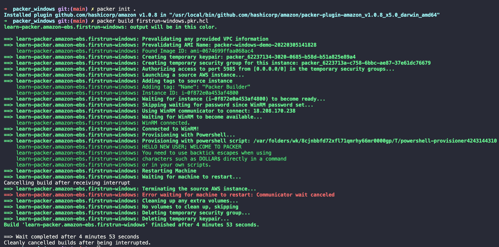

# packer_windows
Repository to Build a Windows Image in Aws

## The Challenge

One issue we run into when provisioning Windows AMIs on Amazon is that out of the box, the instance created from our source AMI is not configured to allow Packer to connect to it. So how do we fix it so that Packer can connect to and customize our instance?

## The Sollution

[Run commands on your Windows instance at launch](https://docs.aws.amazon.com/AWSEC2/latest/WindowsGuide/ec2-windows-user-data.html)

Packer can use an Amazon-provided mechanism called "user-data" to run a set of pre-supplied commands within the instance shortly after the instance starts.

This means we need to give Packer the commands required to configure the instance for a remote connection. Once the commands are run, Packer will be able to connect directly in to the instance and make the customizations we need.

Here's a basic example of a file that will configure the instance to allow Packer to connect over WinRM. We will add this file to the build source section of our build template.

Note the <powershell> and </powershell> tags at the top and bottom of the file. These tags tell Amazon we'd like to run the enclosed code with PowerShell. You can also use <script></script> tags to enclose any commands that you would normally run in a Command Prompt window. See Running Commands on Your Windows Instance at Launch for more info about what's going on behind the scenes here.

## How to run

```
packer init .
packer build firstrun-windows.pkr.hcl
```





## Reference
[Hashicorp learn](https://learn.hashicorp.com/tutorials/packer/aws-windows-image?in=packer/integrations)